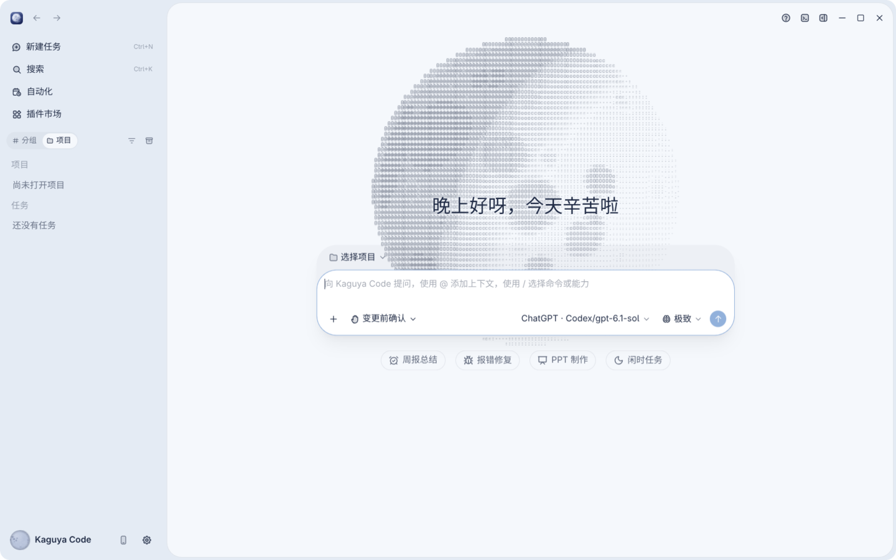
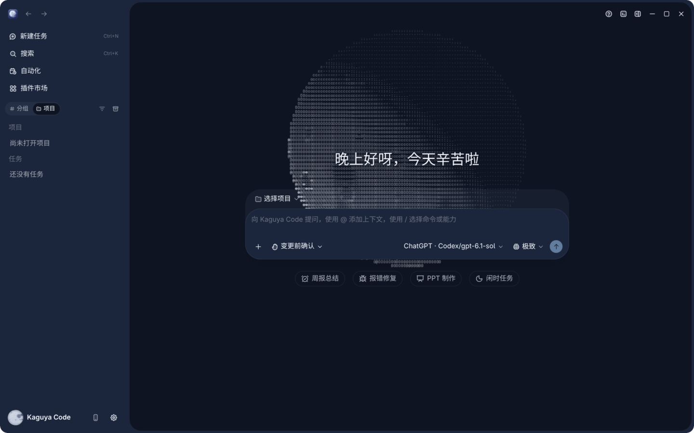
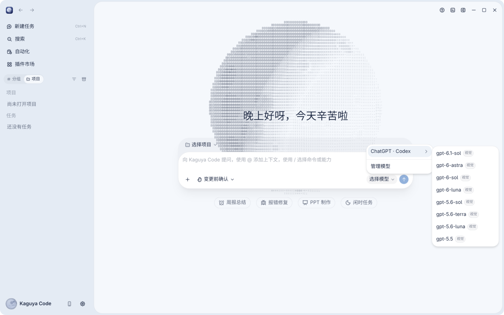
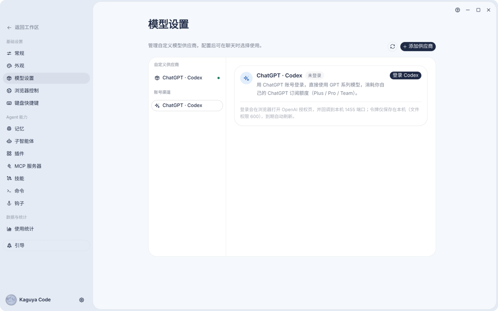
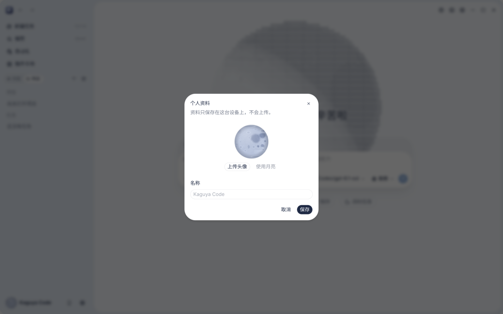
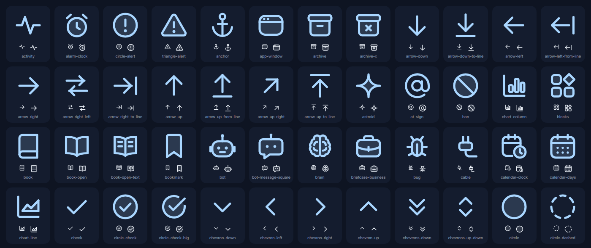
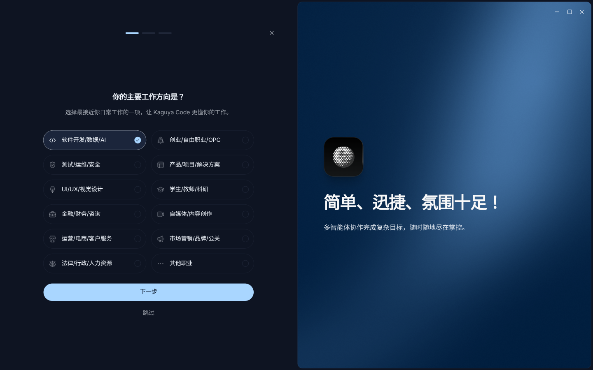
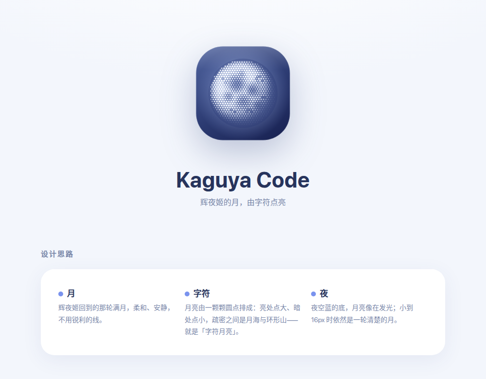

# Kaguya Code

<div align="center">
  
</div>
<p align="center">
  <a href="README.md">简体中文</a> | English
</p>

Kaguya Code is an AI coding workspace with desktop, browser, and terminal interfaces. This repository contains the clients, backend services, shared UI, and Agent CLI and runtime source code.

> This is an unofficial fork of [zai-org/ZCode](https://github.com/zai-org/ZCode) v3.14.3, kept under the Apache-2.0 license (see [LICENSE](LICENSE), [NOTICE.md](NOTICE.md), [THIRD-PARTY-NOTICES.md](THIRD-PARTY-NOTICES.md)). It is not affiliated with the upstream team.
>
> Main differences from upstream:
>
> - Renamed to Kaguya Code, with a new app icon (a dot-matrix "character moon") and a restyled UI (cold white, rounded, animated).
> - Zhipu platform login removed.
> - New ChatGPT (Codex account OAuth) channel for GPT models.
> - Editable avatar and display name in the sidebar; the default avatar is a rotating moon.
>
> Internal package names (`@zcode/*`), the `~/.zcode` data directory, the `zcode://` protocol and `ZCODE_*` environment variables are kept from upstream.
>
> Privacy: the app no longer sends any request to the upstream server at startup (client-config fetch, help config, rollout flags, forced-update check and auto-update were removed; they used to carry version, platform and a device ID). Telemetry and crash-report endpoints are empty by default, so nothing is reported. The remaining upstream-related features only run when you use them (feedback, conversation share) or on demand (CDN refresh of the built-in provider config, the official plugin marketplace).

## Screenshots

<p align="center">
  
</p>

<table>
  <tr>
    <td width="50%"><br /><sub>Dark theme, same character moon</sub></td>
    <td width="50%"><br /><sub>Model picker: GPT models under the ChatGPT · Codex channel</sub></td>
  </tr>
  <tr>
    <td width="50%"><br /><sub>Settings → Model settings → Account channels: sign in with a ChatGPT account</sub></td>
    <td width="50%"><br /><sub>Editable avatar and name; the default avatar is a rotating moon</sub></td>
  </tr>
</table>

<p align="center">
  <br />
  <sub>Hand-drawn icon set (<a href="packages/lunar-icons/">packages/lunar-icons</a>)</sub>
</p>

<p align="center">
  
  <br />
  <sub>First-run onboarding, and the app icon: a dot-matrix character moon on a night-blue tile</sub>
</p>

> All screenshots were taken on a clean, empty profile and contain no personal data. The model list comes from the built-in ChatGPT · Codex list, signed-out.

## Updates

- 2026-10-05: Renamed to Kaguya Code, added the Codex channel, new icon.

## Setup

Install Git, Node.js **24.14.0**, and pnpm **10.33.2**. [mise.toml](mise.toml) is the source of truth for tool versions. Run all development and packaging commands below from the repository root.

```bash
pnpm bootstrap
```

`pnpm bootstrap` installs workspace dependencies, prepares local desktop runtime assets, and runs `build:bootstrap`.

The Agent CLI and runtime source code lives in [apps/zcode-cli/](apps/zcode-cli/) as a regular directory included when you clone this repository. No separate checkout or Git submodule initialization is required.

Additional setup and build commands:

| Command                        | Purpose                                                                                                                             |
| ------------------------------ | ----------------------------------------------------------------------------------------------------------------------------------- |
| `pnpm install`                 | Install dependencies                                                                                                                |
| `pnpm prepare:desktop-runtime` | Prepare desktop runtime assets, including remote assets by default                                                                  |
| `pnpm prepare:remote-assets`   | Prepare remote runtime assets separately                                                                                            |
| `pnpm bootstrap:with-remote`   | Set up dependencies and local and remote assets, then build the relevant packages sequentially; skip the desktop application bundle |
| `pnpm build`                   | Recursively run each workspace package's build script, including its asset preparation steps                                        |

The default `bootstrap` skips remote asset preparation and is suitable for local desktop development. Run the corresponding preparation command when working with remote workspaces or validating remote distribution assets.

## Development and Usage

### Desktop

```bash
pnpm dev:desktop

# Use the test environment
pnpm dev:desktop:test
```

`pnpm dev:desktop` defaults to `pnpm dev:desktop:prod` and uses production service configuration. The startup script prepares local runtime assets, builds the desktop Agent, then starts Electron and source watchers.

Set `ZCODE_DATA_BASE_DIR` to use a separate development data directory. For example, on macOS / Linux:

```bash
ZCODE_DATA_BASE_DIR="$HOME/.zcode-dev-home" pnpm dev:desktop:test
```

### Web Development

Use development mode when editing Web or backend source code:

```bash
pnpm dev:web

# Set the backend workspace (macOS / Linux)
ZCODE_SERVER_WORKSPACE=/path/to/project pnpm dev:web
```

This starts both the Web development server (default: `http://localhost:5173`) and the backend (default: `http://localhost:3030`). Open the Web development server in your browser. `/ws` and general `/api` requests are proxied to the local backend; `/api/v1/oauth/token` is proxied separately to the configured product service.

After changing Agent source code, run `pnpm --filter @zcode/cli... build` and restart the service. To validate the complete distribution, extract and run it as described under Packaging → ZCode CLI distribution below.

### ZCode CLI distribution

The command-line distribution includes the TUI, Web client, and Agent behind one `zcode` command. With no arguments it starts the TUI; a leading `--web` starts Web mode; all other arguments go to the existing Agent CLI. Both modes run locally without Electron.

```bash
# Start the terminal UI by default
zcode

# Start the Web interface
zcode --web

# Set the project and port without opening a browser automatically
zcode --web --workspace /path/to/project --port 3030 --no-open

# Show CLI or Web options
zcode --help
zcode --web --help
```

In Web mode, it uses the current directory as the workspace, listens on `127.0.0.1` without token authentication by default, selects an available port, and opens a browser. Use the URL printed in the terminal and press `Ctrl+C` to stop the service. For LAN access, use `--host 0.0.0.0`; listening on a non-local address generates an access token by default. Use the token-bearing URL printed in the terminal. Set a token with `--token`, or disable token authentication with `--no-token`.

When starting the general Web service's HTTP entry directly, configure API/WebSocket authentication with `ZCODE_SERVER_AUTH_TOKEN`. When creating the service programmatically, use the `authToken` option.

See Packaging below for build instructions. `pnpm build:zcode` only creates the distribution; it does not replace an existing `zcode` on `PATH`. If the command still points to an older installation or another checkout, check it with `command -v zcode` on macOS / Linux or `where.exe zcode` on Windows.

### Quick start (desktop app installed)

To skip building the distribution package, use the launcher [`scripts/kaguya-cli`](scripts/kaguya-cli):

```bash
# First time: build the CLI and its dependencies (including the TUI)
pnpm --filter "@zcode/cli..." build

scripts/kaguya-cli                  # terminal UI (TUI)
scripts/kaguya-cli -p "Explain this repo"   # one-shot prompt, no TUI
scripts/kaguya-cli --help

# To run it as `kaguya-cli` from any directory:
ln -s "$PWD/scripts/kaguya-cli" ~/.local/bin/kaguya-cli
```

The TUI's native library needs Node 24.14.0; with another Node version it fails with `Node FFI backend does not support usize`. The launcher prefers the Electron runtime of the installed desktop app (`/opt/Kaguya Code`), which embeds Node 24.14.0. The CLI shares configuration, models and sessions with the desktop app via `~/.zcode`, including the ChatGPT · Codex channel.

### CLI Source Development

Use the source entry when developing the TUI or Agent:

```bash
pnpm --filter @zcode/cli dev --help
pnpm --filter @zcode/cli dev

# Build the CLI and its workspace dependencies
pnpm --filter @zcode/cli... build
node apps/zcode-cli/packages/cli/dist/zcode.cjs --help
```

This entry runs the Agent CLI directly and does not handle the distribution's `--web` switch. Use `pnpm dev:web` for Web development, or the extracted `bin/zcode.mjs` shown below to test the unified command.

## Configuration

The root [.env.example](.env.example) provides sample service URLs and build configuration. Copy it to `.env` as needed and place local overrides in `.env.local`. Select the Desktop development environment with `dev:desktop:test` or `dev:desktop:prod`.

| Setting                              | Purpose                                                                                 |
| ------------------------------------ | --------------------------------------------------------------------------------------- |
| `ZCODE_DATA_BASE_DIR`                | Base directory for application data, stored under its `.zcode/` subdirectory            |
| `ZCODE_SERVER_WORKSPACE`             | Workspace path for the Web backend                                                      |
| `ZCODE_BUILTIN_PROVIDER_CONFIG_FILE` | Path to a local provider configuration file; uses the built-in configuration when unset |
| `ZCODE_DIST_BASE_URL`                | Download base URL used by the CLI distribution installer                                |

Runtime variables can be set explicitly in the environment of the startup command. See [config/README.md](config/README.md) for the default configuration shipped with the client.

## Packaging

See [third-party/README.md](third-party/README.md) for notice generation, distribution checks, and where the notices are included in each distribution.

### Desktop

```bash
pnpm bundle:desktop

# Set the target platform and CPU architecture
pnpm bundle:desktop -- --os win --arch x64

pnpm bundle:desktop -- --help
```

The default target is macOS arm64, and the default output directory is `packages/desktop/dist/`. `--os` accepts `mac`, `win`, or `linux`; `--arch` accepts `x64` or `arm64`. Packaging and signing require the tools and configuration for the target platform.

### ZCode CLI distribution

Run `pnpm build:zcode` to build the CLI/TUI, backend, and Web client, collect the TUI native libraries, workers, and runtime dependencies, then assemble the distribution. Running the distribution still requires Node.js; use the version specified in `mise.toml`.

Before packaging, set the download base URL with `ZCODE_DIST_BASE_URL` in `.env`, `.env.local`, or the process environment, or pass it through `--base-url`. The URL below is a placeholder; replace it with your hosting URL when publishing:

```bash
pnpm build:zcode --base-url https://downloads.example.com/zcode/

# When ZCODE_DIST_BASE_URL is already configured
pnpm build:zcode

# Repackage existing Agent, backend, and Web build outputs
pnpm build:zcode --skip-build

# Show options for the version, output directory, and more
pnpm build:zcode --help
```

The version defaults to the root `package.json` version. Output is written to `dist/zcode/`:

- `releases/<version>/zcode-<version>.tar.gz`: runtime package.
- `releases/<version>/sha256.txt`: checksum file.
- `latest.json` and `install.sh`: version index and installer.

Upload the entire directory to the configured download base URL. The installer downloads the runtime package from that URL, installs it to `~/.zcode/runtime` by default, and creates the `zcode` command in `~/.local/bin`. Override these directories with `ZCODE_DIST_HOME` and `ZCODE_DIST_BIN_DIR`, respectively.

Existing Lite users should switch to the new build command, environment variables, and installer. Installation does not remove old Lite directories or migrate/delete session data.

To test a packaged build locally, extract and run it directly without uploading or installing it:

```bash
zcode_version=$(node -p "require('./dist/zcode/latest.json').version")
mkdir -p dist/zcode/debug
tar -xzf "dist/zcode/releases/$zcode_version/zcode-$zcode_version.tar.gz" \
  -C dist/zcode/debug
# Start the TUI by default
node dist/zcode/debug/zcode/bin/zcode.mjs

# Start Web mode
node dist/zcode/debug/zcode/bin/zcode.mjs --web \
  --workspace "$PWD" --port 3030 --no-open
```

Open `http://127.0.0.1:3030` to validate the complete flow, with one backend serving the Web pages and running the Agent. The port must be available; if `pnpm dev:web` is already running, choose another `--port`.

## Repository Structure

| Directory                                            | Responsibility                                                                          |
| ---------------------------------------------------- | --------------------------------------------------------------------------------------- |
| `packages/desktop`                                   | Electron Main, Host, Renderer, and desktop packaging                                    |
| `packages/web`                                       | Web client                                                                              |
| `packages/server`                                    | HTTP / WebSocket services and remote connections                                        |
| `packages/zcode-server-cli`                          | Standalone server startup and process management                                        |
| `packages/ui`                                        | Shared React components, hooks, and Zustand state                                       |
| `packages/services`                                  | Business services and persistence                                                       |
| `packages/shared`, `packages/rpc`, `packages/client` | Shared protocols and types, RPC framework, and Agent client SDK                         |
| `packages/provider`, `packages/provider-node`        | Common provider capabilities and Node implementations                                   |
| `apps/zcode-cli`                                     | Agent CLI, TUI, runtime, and tools                                                      |
| `scripts`, `config`, `third-party`                   | Build and maintenance scripts, built-in configuration, and third-party notice materials |

## Project Notice

See [NOTICE.md](NOTICE.md) for feature and promotion scope, maintenance policy, execution and data risks, licensing, and third-party copyright information.
